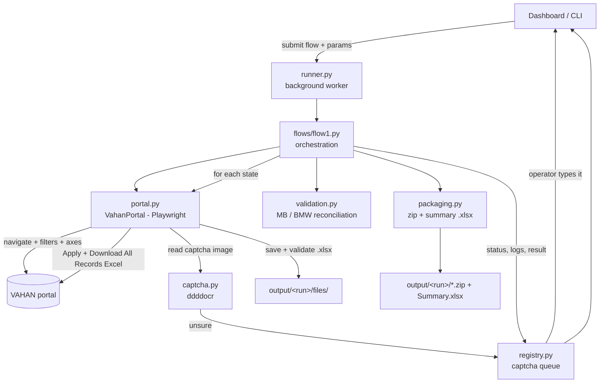

# Project Overview & Walkthrough

A plain-language guide to **what** was built, **where** it lives, and **why** it
was done this way — so you can follow the code and continue confidently.

- Audience: whoever maintains or extends this automation.
- Companion docs: [`README.md`](../README.md) (setup + commands),
  [`docs/STEP-1-RUNBOOK.md`](STEP-1-RUNBOOK.md) (install + smoke test),
  [`docs/CALIBRATION-FINDINGS.md`](CALIBRATION-FINDINGS.md) (what the live portal
  actually looks like and why the code is shaped the way it is).

---

## 1. What we are automating (the PDD in plain terms)

The Sales & Marketing team manually downloads vehicle-registration reports from
the government **VAHAN Public Report portal**. The PDD asks for a bot that does
this for **all 36 States/UTs** and **~1700 RTOs**, on a schedule, with consistent
filters, standard file names, a zip per run, and a data-accuracy check.

There are **four flows**. They are the same pipeline with different loop
dimensions and axis settings:

| Flow | Loops over | Y-axis / X-axis | Time period | Output file name |
|---|---|---|---|---|
| **1** `Vahan_StateMonthwise` | 36 states | Maker / Month-wise | whole calendar year | `Monthwise_YYYY-{StateCode}.xlsx` |
| **2** `Vahan_StateFuelwise` | 36 states × each month Jan→now | Fuel / Maker | one month at a time ("1 Month Flexible") | `Fuelwise_YYYY-{MonthCode}-{StateCode}.xlsx` |
| **3** `Vahan_RTO-Monthwise` | 36 states × every RTO | Maker / Month-wise | calendar year | `Monthwise_YYYY-{StateCode}-{RTOCode}.xlsx` |
| **4** `Vahan_RTOFuelwise` | states × RTOs × months | Fuel / Maker | one month at a time | `Fuelwise_YYYY-{MonthCode}-{StateCode}-{RTOCode}.xlsx` |

**Constant filters for every flow** (PDD Stage 2):

- Archived Flag = all four values: `ACTIVE_COMPLIANT`, `ACTIVE_NON_COMPLIANT`,
  `PERMANENT_ARCHIVE`, `TEMPORARY_ARCHIVE`
- Year Type = Calendar Year
- Vehicle Sub-Category = `LIGHT MOTOR VEHICLE` + `LIGHT PASSENGER VEHICLE`

**Every "Apply" is gated by a text CAPTCHA** (PDD Stage 4): read the image,
type the characters, submit; retry up to 5 times, then log and move on.

**End of every run** (PDD Stage 8): move files to an output folder → zip →
verify the count → **reconcile** the MB and BMW maker buckets against the
"All India" totals → produce an execution summary → email it → close the browser.

> **Maker buckets** (PDD Step 8.2)
> **MB** = `MERCEDES BENZ`, `MERCEDES BENZ - AG`, `MERCEDES BENZ INDIA PVT LTD`, `DAIMLER AG`
> **BMW** = `BMW INDIA PVT LTD`

---

## 2. Design decisions (what we chose and why)

| Decision | Choice | Why |
|---|---|---|
| Language / driver | **Python + Playwright (Chromium)** | The portal is a JavaScript app with dynamic dropdowns and a calendar widget. Playwright handles waits and dynamic elements far more reliably than Selenium; Python matches typical RPA/analytics tooling. |
| Interface | **FastAPI web dashboard** (+ a headless CLI) | The PDD says "we make one website for that". The dashboard lets an operator start runs, watch progress/logs, answer captcha prompts, and download the zip. The CLI (`tools/run_flow.py`) covers the scheduled/daily cadence. |
| Captcha | **Auto OCR (`ddddocr`) with manual fallback** | `ddddocr` is a pip-only model tuned for exactly this style of captcha — no system install. When it is unsure, the run pauses and asks a human in the dashboard, so a bad guess never silently stalls a long run. |
| Build order | **Flow 1 fully first**, Flows 2–4 reuse the engine | Flow 1 exercises the entire pipeline (filters → loop → captcha → download → rename → zip → reconcile → summary). Once it is solid, the others are mostly extra loops. |
| Email | **Stubbed for now** — produce zip + summary `.xlsx` only | Real sending needs your SMTP host/credentials and recipient list. Everything up to "hand the summary to the mailer" is done. |
| One run at a time | **Single background worker** | It is a shared browser session against a government site; we do not parallelise requests. |
| Selectors in config | **All locators in `config.yaml`** | The PDD only had screenshots, not element ids. Keeping every selector in one file means we calibrate against the live site without touching Python. |

---

## 3. How a run flows through the code



**Step by step for Flow 1:**

1. Operator clicks **Start run** (or the scheduler calls the CLI).
2. `runner.py` picks up the job and calls `run_flow1(run, cfg)`.
3. `flow1.py` creates `output/<run_id>_flow1_<timestamp>/` and opens the portal
   via `VahanPortal` (`portal.py`).
4. Common filters + axes (Maker / Month-wise) are set once.
5. The list of states is read **from the live dropdown** (falls back to
   `data/state_master.csv` if that read fails).
6. For each state: clear the previous chip → search + select the state →
   `solve_captcha_and_apply()` → `download_excel()` → rename to
   `Monthwise_YYYY-{code}.xlsx`. Failures are logged and the loop continues.
7. The **All-India** file (states = "All") is downloaded into a separate
   `all_india/` folder — used only for reconciliation, **not** zipped.
8. `packaging.make_zip()` zips the 36 state files.
9. `validation.reconcile()` sums MB and BMW per month across the 36 files and
   compares to the All-India file month by month.
10. `packaging.write_summary_xlsx()` writes **Execution Summary** +
    **Reconciliation** sheets.
11. `run.result` is filled with paths and counts; the dashboard shows download
    links.

---

## 4. File-by-file — what, where, why

### Configuration & data

| Path | What it holds | Why it exists |
|---|---|---|
| [`config.yaml`](../config.yaml) | Portal URL, timeouts, retry counts, constant filter values, reconciliation buckets, **all selectors** | Single place to tune everything portal-specific without code changes. |
| [`data/state_master.csv`](../data/state_master.csv) | 36 States/UTs → short codes (`Maharashtra → MH`) | File-name codes and an expected-count / fallback list when the live dropdown can't be read. |
| [`requirements.txt`](../requirements.txt) | Pinned dependencies | Reproducible installs. |

### `backend/` — the API + scraper engine

| Path | Responsibility | Key points |
|---|---|---|
| [`backend/config.py`](../backend/config.py) | Load `config.yaml`; resolve paths; map a state label to its code (`state_code_for`) | `state_code_for` normalises "&"/"."/"-" and does a loose match so live labels still resolve. |
| [`backend/registry.py`](../backend/registry.py) | In-memory, thread-safe run state: status, progress, **logs**, and the **manual-captcha queue** | `Run` objects hold everything the dashboard shows. `CaptchaRequest` uses a `threading.Event` so the scraper thread blocks until the operator submits (or 10-min timeout). |
| [`backend/captcha.py`](../backend/captcha.py) | `ddddocr` wrapper: `recognise()`, `clean()`, `looks_plausible()` | Model is loaded lazily so the web server starts even before deps settle. Output is upper-cased, non-alphanumerics stripped. |
| [`backend/portal.py`](../backend/portal.py) | **`VahanPortal`** — the Playwright page-object | Context manager (launch/close browser). All locators come from `config.yaml`. Helpers: `set_multi`, `select_only_state`, `state_options`, `apply_common_filters`, `set_axes_maker_monthwise`, `solve_captcha_and_apply`, `download_excel`. Navigation retries + captcha retries live here (PDD Business Exceptions table). |
| [`backend/validation.py`](../backend/validation.py) | Parse each exported `.xlsx` (Maker rows × Month columns) and run the MB/BMW reconciliation | Tolerant parser: finds the header row containing "Maker", detects month columns by name, ignores `Total` rows. `reconcile()` returns per-bucket, per-month `sum_of_states` vs `all_india` with a `delta` and `match`. |
| [`backend/packaging.py`](../backend/packaging.py) | `make_zip()`, `write_summary_xlsx()` (Execution Summary + Reconciliation sheets), `timestamp_slug()` | PDD Stage 8 outputs. |
| [`backend/flows/__init__.py`](../backend/flows/__init__.py) | `REGISTRY` mapping flow id → function | Add Flows 2–4 here. |
| [`backend/flows/flow1.py`](../backend/flows/flow1.py) | **Flow 1 orchestration** (`run_flow1`) | Params: `states` (subset for smoke tests), `skip_all_india`, `skip_reconciliation`. Per-state failures don't abort the run. |
| [`backend/runner.py`](../backend/runner.py) | Single daemon worker thread + a `queue.Queue`; `submit()` | One run at a time; catches crashes; forces a Windows Proactor event loop so Playwright can launch the browser from the worker thread. |
| [`backend/main.py`](../backend/main.py) | FastAPI JSON API + serves `../frontend/` as static files; CORS open | Endpoints: `POST /api/runs`, `GET /api/runs[/{id}]`, `GET /api/runs/{id}/logs`, `POST /api/runs/{id}/captcha`, `POST /api/runs/{id}/cancel`, `GET /api/runs/{id}/download?which=zip|summary`. |

### `frontend/` — the dashboard (separate folder, no build step)

| Path | Responsibility | Key points |
|---|---|---|
| [`frontend/index.html`](../frontend/index.html) | Page shell | Loads React + ReactDOM from cdnjs, then `styles.css` and `app.js`. |
| [`frontend/styles.css`](../frontend/styles.css) | White + sky-blue theme | Tokens, cards, status pills, animated progress bar, dark log panel. |
| [`frontend/app.js`](../frontend/app.js) | The React app | `React.createElement` (no JSX/Babel). Polls `/api/*` every 1.5–2 s. Components: `StartCard`, `RunsCard`, `DetailPane`, `Captcha`, `Stats`, `Downloads`, `LogView`. `API_BASE` at the top switches it to a separately-hosted backend. |

### `tools/` — operational scripts

| Path | Purpose |
|---|---|
| [`tools/calibrate.py`](../tools/calibrate.py) | Opens the live portal, dumps `calibration/page.png`, `page.html`, `controls.json`, and prints every visible control with its id/name/label. **Run this before the first real run** to fill in `config.yaml → selectors`. |
| [`tools/run_flow.py`](../tools/run_flow.py) | Headless CLI: `python -m tools.run_flow flow1_state_monthwise [--states ...] [--skip-all-india] [--skip-reconciliation]`. For Windows Task Scheduler. |

---

## 5. Mapping the PDD to the code

| PDD (Flow 1) | Where it happens |
|---|---|
| Stage 1 — launch browser, open report page, wait for filters | `VahanPortal.__enter__`, `open_report_page` (3 nav retries) |
| Stage 2.1 — Archived Flag = All | `apply_common_filters` → `set_multi("archived_flag_select", ...)` |
| Stage 2.2 — Sub-Category = LMV + LPV | `apply_common_filters` → `set_multi("sub_category_select", ...)` |
| Stage 2.3 — Y-Axis = Maker, X-Axis = Month-wise | `set_axes_maker_monthwise()` (option values `vehicleMakerName` / `monthWise`) |
| Stage 3 — read state list, loop, clear/select/verify | `flow1.py` loop + `state_options`, `select_only_state` |
| Stage 4 — capture captcha, OCR, submit, 5 retries, log on exhaustion | `solve_captcha_and_apply` (+ `captcha.py`, `registry` fallback) |
| Stage 5 — click Apply (full-page POST), wait for report / no errors | `solve_captcha_and_apply` → `_wait_report_ready`, `_captcha_error_text` |
| Stage 6 — Download All Records Excel, validate, rename | `download_excel` (size > 0, no temp ext) + `flow1.py` dest name |
| Stage 7 — repeat for all 36 | `flow1.py` `for state in states` |
| Stage 8.1 — move to output folder + zip | `packaging.make_zip` |
| Stage 8.2 — All-India file (not zipped) + MB/BMW reconciliation | `flow1.py` `all_india` block + `validation.reconcile` |
| Stage 8.3 — execution summary | `packaging.write_summary_xlsx` (Execution Summary sheet) |
| Stage 8.4 — close browser | `VahanPortal.__exit__` |
| Business Exceptions — website 3 retries / captcha 5 retries / report retry | `config.yaml portal.*_retries`, used in `portal.py` |

---

## 6. Output layout

```
output/<run_id>_flow1_<timestamp>/
├── files/
│   ├── Monthwise_2026-AN.xlsx
│   ├── Monthwise_2026-AP.xlsx
│   └── ...                          ← 36 files, these are zipped
├── all_india/
│   └── Monthwise_2026-ALL-INDIA.xlsx  ← reference only, NOT zipped
├── Flow1_StateMonthwise_2026_<timestamp>.zip
└── Flow1_Summary_<timestamp>.xlsx     ← Execution Summary + Reconciliation (+ File Errors)
```

`downloads/` is Chromium's scratch folder before files are renamed/moved.
`logs/` is reserved for future file logging (logs are currently in-memory + dashboard).

---

## 7. Current status & known gaps

**Done & live-tested (2026-09-09):** Flow 1 wired against the **real portal**
and calibrated — see [`docs/CALIBRATION-FINDINGS.md`](CALIBRATION-FINDINGS.md).
Smoke tests passed: 1-state, 3-state loop, and 2-state + All-India +
reconciliation. `config.yaml → selectors` now holds real element ids. Dashboard,
captcha OCR + manual fallback, zip, reconciliation, summary, headless CLI all
working. All modules compile on Python 3.12.

**Full 36-state run — DONE & PASSED (2026-09-10, run `1789015865-4`):** 36/36 files,
0 failures, 4.6 min. **Step 8.2 reconciliation PASSED** — MB and BMW, every month
Jan–Sep, `sum of 36 state files == All-India file` exactly (delta 0 on all 18
rows). Zip has the 36 files, All-India excluded. Only 2 captcha misreads across
37 items, both auto-recovered.

**Flow 2 — `Vahan_StateFuelwise` — DONE & tested (2026-09-10):** 36 states × each
month Jan..now, Y-Axis = Maker, X-Axis = Fuel, period via `#reportType=9` +
`#reportYear`/`#reportMonth` (the portal's own `setMonthRange` fills the
`.dpd3/.dpd4` datepickers). File name `Fuelwise_YYYY-{MON}-{CODE}.xlsx`.
Reconciliation (PDD Step 8.2): per state & bucket, Σ Flow 2 monthly totals (YTD)
== Flow 1 state total — verified **PASS** for Goa across all 9 months. Auto-finds
the latest Flow 1 output, or takes `flow1_dir`.

**Gaps / next:**

1. ~~Full 36-state run~~ ✅ &nbsp; ~~Flow 2~~ ✅
2. **Email sending** is stubbed — needs SMTP host, port, credentials, recipients.
3. **Flows 3–4** not built yet (add the `#rtoCode` RTO loop; Flow 4 also nests the month loop).
4. **Captcha at scale** — `ddddocr` solved every captcha first-try in testing but
   will miss occasionally over 36+ POSTs; the 5-retry loop + dashboard manual
   fallback cover it. Fully-unattended CLI runs are OCR-only (`--manual-captcha`
   to enable the pause).

---

## 8. Next action

Go to **[`docs/STEP-1-RUNBOOK.md`](STEP-1-RUNBOOK.md)** — install dependencies,
run the calibration, fill in the selectors, and do a one-state smoke test.
